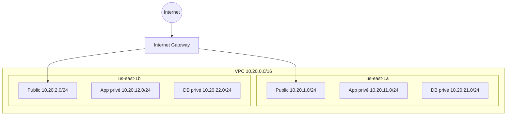

# Architecture

```mermaid
flowchart TB
  Internet((Internet)) --> IGW[Internet Gateway]
  subgraph VPC["VPC 10.20.0.0/16"]
    subgraph AZa["us-east-1a"]
      PubA[Public 10.20.1.0/24]
      AppA[App privé 10.20.11.0/24]
      DbA[DB privé 10.20.21.0/24]
    end
    subgraph AZb["us-east-1b"]
      PubB[Public 10.20.2.0/24]
      AppB[App privé 10.20.12.0/24]
      DbB[DB privé 10.20.22.0/24]
    end
  end
  IGW --> PubA
  IGW --> PubB
```

Le NAT Gateway, les Security Groups, l'ALB, les instances et la base s'ajoutent dans les niveaux suivants.
